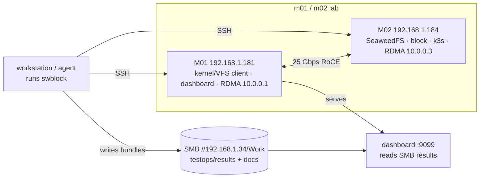

# Deploy & Operate

How the runner and dashboard are built and run on the shared lab.

## Build the binaries

```bash
make build               # every cmd/ binary into ./bin
make build-swblock       # just one
go test ./... -count=1   # unit tests
```

Each binary is `core + chosen packs` ([Packs & Binaries](packs-and-binaries.md)).
The runner itself needs no install on the lab — you run it from your workstation
and it drives the nodes over SSH.

## Lab topology



The runner writes each run **bundle** to the shared SMB results root; the
dashboard on M01 reads that root. Bundles live on SMB, **not** on m01/m02 local
disk.

## Nodes (how the runner reaches machines)

A scenario's `topology.nodes` maps a name to a machine; actions target a node by
name and the runner runs the command there via **`infra.Node`** (SSH or local):

```yaml
topology:
  nodes:
    m02: { host: 192.168.1.184, user: testdev, key: ~/.ssh/testdev_key }
    m01: { host: 192.168.1.181, user: testdev, key: ~/.ssh/testdev_key, alt_ips: [10.0.0.1] }
```

```bash
swblock run <scenario> -results-dir /mnt/smb/work/share/testops/results/<project>
```

## Dashboard (systemd on M01)

The read-only [dashboard](dashboard.md) runs as a systemd service so it survives
reboots:

```ini
# /etc/systemd/system/testops-dashboard.service
[Service]
User=testdev
ExecStart=/usr/local/bin/testops-dashboard \
  -root /mnt/smb/work/share/testops/results \
  -docs /mnt/smb/work/share/testops/docs -port 9099
Restart=always
```

```bash
sudo systemctl enable --now testops-dashboard
# redeploy a new build (install -m 755 keeps the exec bit; plain cp drops it → 203/EXEC):
sudo install -m 755 testops-dashboard /usr/local/bin/testops-dashboard
sudo systemctl restart testops-dashboard
```

## Controller-Lite (M01 RDMA CI)

Before a full web/API controller exists, M01 can run a small file-queue worker
for RDMA gates:

```bash
# Submit a run request.
TESTOPS_MONO_REF=main ./scripts/testops-ci-submit.sh

# Process one request, useful for manual validation.
./scripts/testops-ci-worker.sh --once

# Or run continuously under systemd/cron.
TESTOPS_POLL_SECONDS=10 ./scripts/testops-ci-worker.sh
```

The worker:

- reads requests from `/mnt/smb/work/share/testops/queue/rdma-ci`;
- takes one lab lock at `/mnt/smb/work/share/testops/locks/rdma-lab.lock`;
- calls `scripts/run-rdma-ci.sh`;
- writes result bundles to `/mnt/smb/work/share/testops/results/rdma-ci`;
- moves requests to `state/rdma-ci/done` or `state/rdma-ci/failed`;
- writes logs under `/mnt/smb/work/share/testops/logs/rdma-ci`.

This is intentionally smaller than the future controller. It proves the team
workflow first: safe trigger, serialized lab use, dashboard-visible evidence.

## Disk hygiene

A weekly **`testops-janitor`** systemd timer on M01 + M02 prunes docker dangling
images and deletes stale `/tmp/sra-*` / `/tmp/mono-*` residue older than 7 days:

```bash
journalctl -u testops-janitor        # what it cleaned
sudo systemctl start testops-janitor.service   # run now
```

Edit `RESIDUE_GLOBS` / `RETAIN_DAYS` in `/usr/local/bin/testops-janitor.sh` to
tune it. If scenarios honor `cleanup`, the janitor rarely has anything to do.
